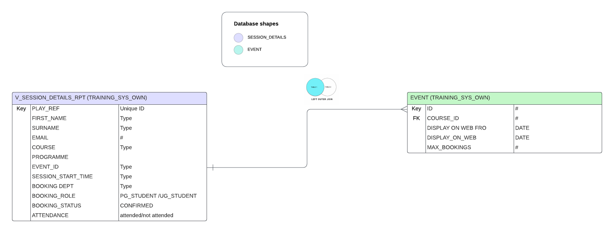
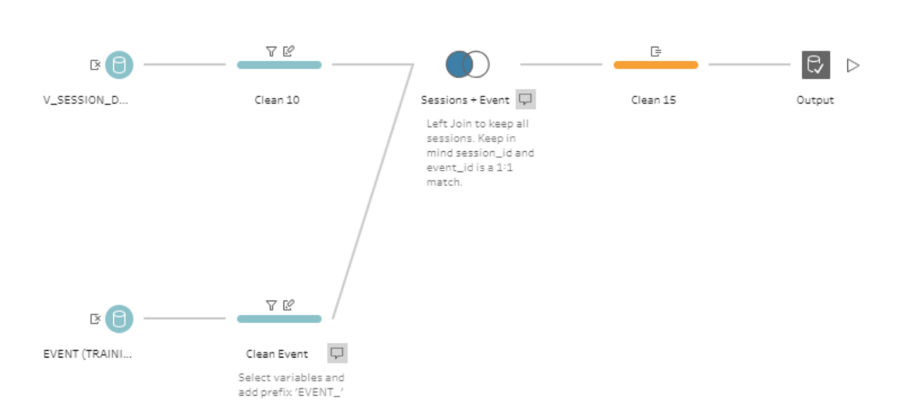

## Tableau Dashboard to Evaluate Digital Skills Lab Workshops

Summary:

In this project Tableau prep is used to design and implement the entity dependent diagram below

https://lucid.app/documents/view/cd93b7e4-ece8-4868-8101-f7a868b86377

Data was filtered, joined and cleaned. Two different databse sources were joined
a) Data for Qualtrics which containes student survey data and their feedback on having attended workshops. Each academeic year had to be combined with the another. 
b) Data for from Oracle database which contains all the booking data 

Due to some of the load put on the Tableau server, an ALteryx solution was also considered. 

Tableau Iteration 1.0
The following Tableau dashboard is based on randomised/incomplete data 

The issue was resolved by re-designing the Tableau flow and using a minimalist approach; taking only the fields which are essentially needed.

The Tableau flow was further refined 

   

The final iteration was developed as the following

https://public.tableau.com/views/Story2_3_17104249025950/Story1?:language=en-US&:sid=&:display_count=n&:origin=viz_share_link

The calculations used in Tableau Prep and Tableau Dashboard can be seen in the file calculations.txt 

   

